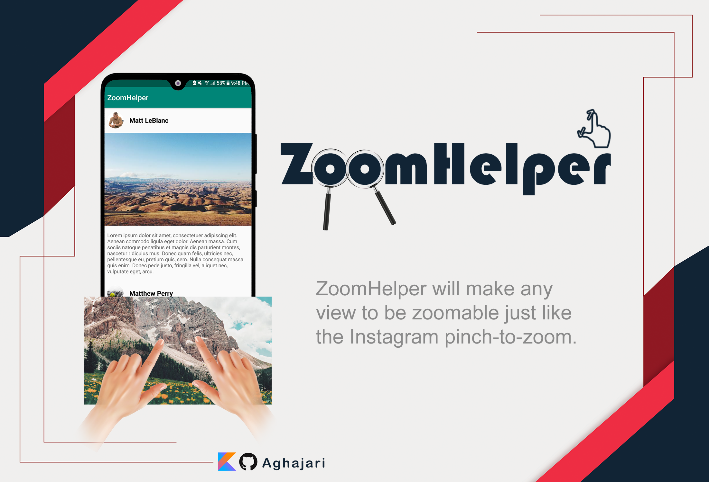
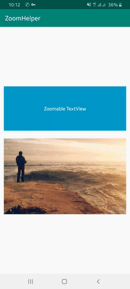
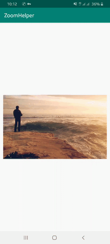

# ZoomHelper
ZoomHelper will make any view to be zoomable just like the Instagram pinch-to-zoom. :wink:


## Installation

ZoomHelper is available in the JCenter, so you just need to add it as a dependency (Module gradle)

Gradle
```gradle
implementation 'com.aghajari.zoomhelper:ZoomHelper:1.0.1'
```

Maven
```xml
<dependency>
	<groupId>com.aghajari.zoomhelper</groupId>
	<artifactId>ZoomHelper</artifactId>
	<version>1.0.1</version>
	<type>pom</type>
</dependency>
```

## Usage (Kotlin)

just override dispatchTouchEvent in your Activity and pass all touch events to ZoomHelper!
```kotlin

override fun dispatchTouchEvent(ev: MotionEvent?): Boolean {
    return ZoomHelper.getInstance().dispatchTouchEvent(ev!!,this) || super.dispatchTouchEvent(ev)
}
            
```

And set View to be zoomable :
```kotlin

ZoomHelper.addZoomableView(view)
//ZoomHelper.addZoomableView(view,tag)

```

Or make a zoomable View by using xml layout :
```xml
<ImageView
        android:id="@+id/imageView"
        android:layout_width="wrap_content"
        android:layout_height="wrap_content">

        <tag android:id="@+id/zoomable" android:value="ZoomableViewTag" />
</ImageView>
```
*Note: \<tag\> is only used in API level 21 and higher*

And we are Done! :smiley:


## Usage (Java)
**Installation:** you have to add kotlin as a dependency! (Module gradle)
```gradle
implementation 'com.aghajari.zoomhelper:ZoomHelper:1.0.1'
implementation 'org.jetbrains.kotlin:kotlin-stdlib:$kotlinVersion' //1.4.0-rc
```

and just override dispatchTouchEvent in your Activity and pass all touch events to ZoomHelper!
```java

@Override
public boolean dispatchTouchEvent(MotionEvent ev) {
	return ZoomHelper.Companion.getInstance().dispatchTouchEvent(ev,this) || super.dispatchTouchEvent(ev);
}
            
```

And set View to be zoomable :
```java

ZoomHelper.Companion.addZoomableView(view);
//ZoomHelper.Companion.addZoomableView(view,tag);

```

Or make a zoomable View by using xml layout :
```xml
<ImageView
        android:id="@+id/imageView"
        android:layout_width="wrap_content"
        android:layout_height="wrap_content">

        <tag android:id="@+id/zoomable" android:value="ZoomableViewTag" />
</ImageView>
```
*Note: \<tag\> is only used in API level 21 and higher*

And we are Done! :smiley:


## Customization
**Kotlin:**
```kotlin
ZoomHelper.getInstance().minScale = 1f
ZoomHelper.getInstance().maxScale = Float.MAX_VALUE
ZoomHelper.getInstance().shadowColor = Color.BLACK
ZoomHelper.getInstance().maxShadowAlpha = 0.6f
ZoomHelper.getInstance().shadowAlphaFactory = 4
ZoomHelper.getInstance().dismissDuration = 200
ZoomHelper.getInstance().layoutTheme = android.R.style.Theme_Translucent_NoTitleBar_Fullscreen
ZoomHelper.getInstance().isEnabled = true
```
**Java:**
```Java
ZoomHelper zoomHelper = ZoomHelper.Companion.getInstance();
zoomHelper.setMinScale(1f);
zoomHelper.setMaxScale(Float.MAX_VALUE);
zoomHelper.setShadowColor(Color.BLACK);
zoomHelper.setMaxShadowAlpha(0.6f);
zoomHelper.setShadowAlphaFactory(4);
zoomHelper.setDismissDuration(200);
zoomHelper.setLayoutTheme(android.R.style.Theme_Translucent_NoTitleBar_Fullscreen);
zoomHelper.setEnabled(true);
```

    

you can disable a zoomable view by using this code :
```kotlin
ZoomHelper.removeZoomableView(view)
```
Or skip a View or a ViewGroup and all its children :
```kotlin
ZoomHelper.skipLayout(view,true)
```
And also you can disable ZoomHelper by using this code :
```kotlin
ZoomHelper.getInstance().isEnabled = false
```
Check the layout is zooming currently :
```kotlin
if (ZoomHelper.getInstance().isZooming) 
```

### Listeners :
You can add callbacks to listen for specific events.

```kotlin
ZoomHelper.getInstance().addOnZoomStateChangedListener(object : ZoomHelper.OnZoomStateChangedListener{
    override fun onZoomStateChanged(zoomHelper: ZoomHelper, zoomableView: View, isZooming: Boolean) {
       Toast.makeText(zoomableView.context,if (isZooming) "Zooming started" else "Zooming ended", Toast.LENGTH_SHORT).show()
       // you can also get zoomableView Tag
       val tag = ZoomHelper.getZoomableViewTag(zoomableView) 
    }
})

ZoomHelper.getInstance().addOnZoomScaleChangedListener(object : ZoomHelper.OnZoomScaleChangedListener{
    override fun onZoomScaleChanged(zoomHelper: ZoomHelper, zoomableView: View, scale: Float, event: MotionEvent?) {
       // called when zoom scale changed
    }
})

ZoomHelper.getInstance().addOnZoomLayoutCreatorListener(object : ZoomHelper.OnZoomLayoutCreatorListener{
    override fun onZoomLayoutCreated(zoomHelper: ZoomHelper, zoomableView: View, zoomLayout: FrameLayout) {
       // called when zoomlayout created (zoom started)
    }
})
```
Also the default view listeners (onClick,onLongClick,onTouch) will work as well!

## Author
Amir Hossein Aghajari

Inspired by [ImageZoom](https://github.com/okaybroda/ImageZoom) library.

License
=======

    Copyright 2020 Amir Hossein Aghajari
    Licensed under the Apache License, Version 2.0 (the "License");
    you may not use this file except in compliance with the License.
    You may obtain a copy of the License at

       http://www.apache.org/licenses/LICENSE-2.0

    Unless required by applicable law or agreed to in writing, software
    distributed under the License is distributed on an "AS IS" BASIS,
    WITHOUT WARRANTIES OR CONDITIONS OF ANY KIND, either express or implied.
    See the License for the specific language governing permissions and
    limitations under the License.
